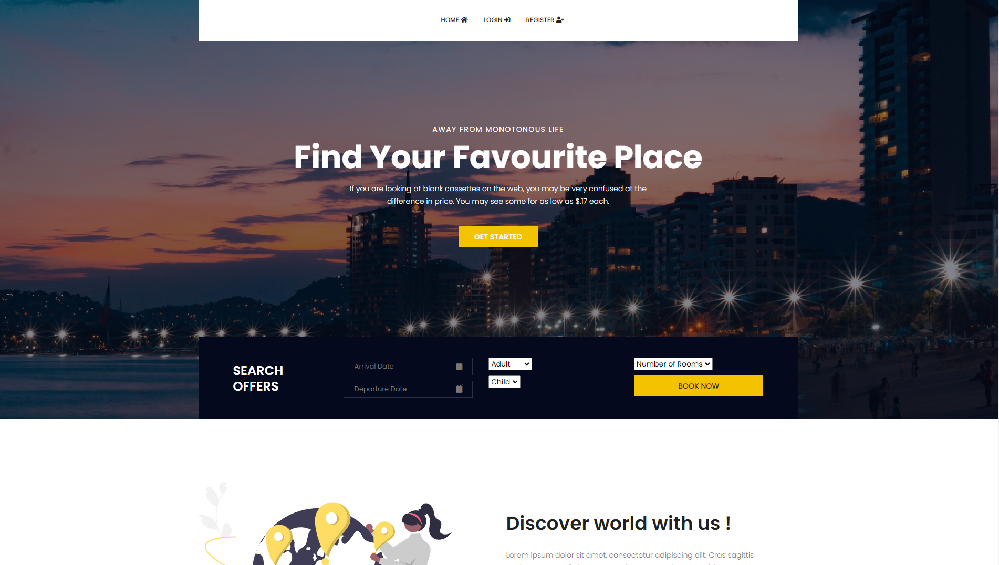
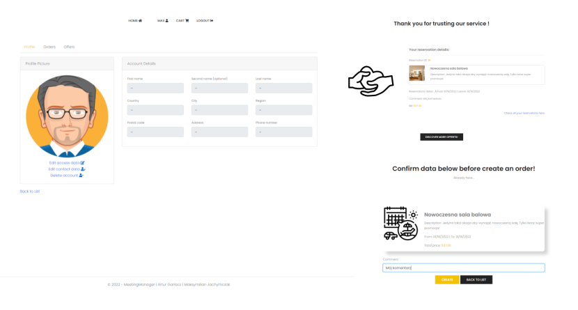

# MeetingManager

## Informacje Generealne:
Projekt realizowany w ramach zaliczenia przedmiotu, wykorzystujący środowisko ASP.NET w wersji 5.0. MeetingManager jest to aplikacja webowa umożliwiająca użytkownikowi 
rezerwację pobytu (oferty) w danej lokalizacji.

## Założenia Projekty:
- [x] Projekt umożliwia rejestrację użytkownika.
- [x] Logowanie użytkownika odbywa się za pomocą loginu lub adresu e-mail użytkownika oraz hasła. 
- [x] Użytkownik może tworzyć oferty jak i przeglądać i rezerwować inne oferty.
- [x] Profil użytkownika przechowuje wszystkie wymagane dane użytkownika, dane personalne,
      oraz dane dostępowe mogę być modyfikowane.
- [x] Użytkownik posiada możliwość usunięcia swojego konta.
- [x] Gotowe rezerwacje można w systemie anulować.
- [x] Przed dokonaniem rezerwacji wybrana przez użytkownika oferta trafia do koszyka (karty)
      gdzie musi zostać ukończony proces rezerwacji.
- [x] Użytkownik informowany jest o rezerwacji ofert drogą mailową, jak również o rejestracji i usunięciu konta.
- [x] Zapytania bazodanowe realizowane są przy pomocy API.
- [x] API aplikacji zabezpieczone jest kluczem.
- [x] Hasła użytkowników są szyfrowane podczas zapisywania w bazie danych zwiększa to bezpieczeństwo użytkwonika.
- [x] Przykładowe dane generowane są podczas uruchamiania projektu.
- [x] Użytkownik może filtrować oferty podczas ich przeglądania, posiada również możliwość filtrowanie
      swoich zamówień oraz wystawionych ofert.

## Technologie:
* DOCKER
* ASP.NET 5.0
* JS
* BOOTSTRAP
* MSSQL

## Instrukacja uruchomienia:

* Pierwszym krokiem jest uruchomienie aplikacji Docker.
* W Visual studio w opcjach uruchamiania projektu należy wybrać:

  > docker-compose
  
* Gdy projekt zostanie zbudowany należy przejśc do przeglądarki i wybrać interesujący nas adres: 

  | API  | USER INTERFACE |
  | ------------- | ------------- |
  | localhost:8088/swagger/index.html  | localhost:8001  |
  
* Poniżej znajduje się lista przykładowo przygotowanych przez nas użytkowników:  

    | USERNAME  | PASSWORD |
  | ------------- | ------------- |
  | example/example@testdomain.com  | 123qwe |
  | user/user@testdomain.com          | 123qwe |

  Wszyscy inni użytkownicy utworzeni podczas startowania projektu posiadają hasło: 123qwe
  
## Dane dostępowe:

* API Key: Pei1deingai
* Hasło bazy danych: Pa55w0rd2021, Login: SA
  
## Autorzy:
* Artur Garlacz
* Maksymilian Jachymczak
